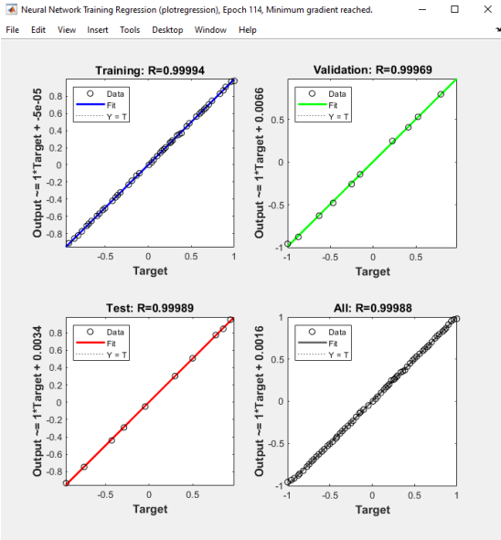
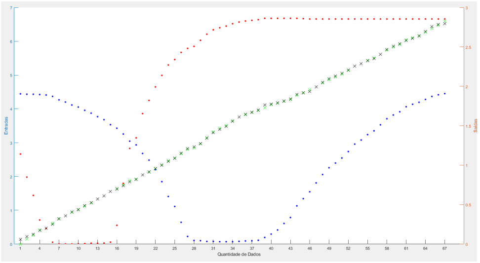
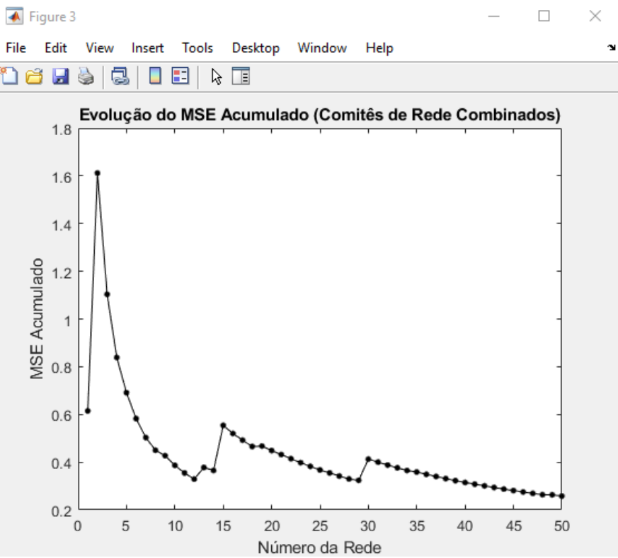

# Smart Position Sensor System with Neural Networks

This project focuses on the application of Artificial Neural Networks (ANN) to estimate the position `y` of a barrier using the output voltages (`v1` and `v2`) from two photovoltaic modules. The displacement of the barrier in the `y` direction will cause different shadow areas on the photovoltaic modules, affecting the output voltages.

## Overview

- **Institution:** FEDERAL INSTITUTE OF EDUCATION, SCIENCE AND TECHNOLOGY OF SANTA CATARINA
- **Course:** Electrical Engineering Degree
- **Subject:** Artificial Neural Networks
- **Student:** Elias Anzini Junior
- **Semester:** 2023/1

## Features

- Estimation of barrier position using output voltages from photovoltaic modules.
- Training of feed-forward neural networks with different topologies.
- Reliability-focused study of the neural network.
- Comprehensive report generation detailing executed activities.

## Requirements

- MATLAB

## Getting Started

1. Clone this repository or download the project files.
2. Navigate to the project directory.
3. Run the main script to start the neural network training and position estimation process.
4. Follow on-screen instructions for further steps.

## Contribution

Contributions to improve the project are welcome. Feel free to open an issue or submit a pull request.

## Contact

For any questions or suggestions, please reach out to: [eliasanzinijlle@outlook.com].

# Results

## Network 1

## Network 1 Graph

## Neural Networks Committee - MSE Results

